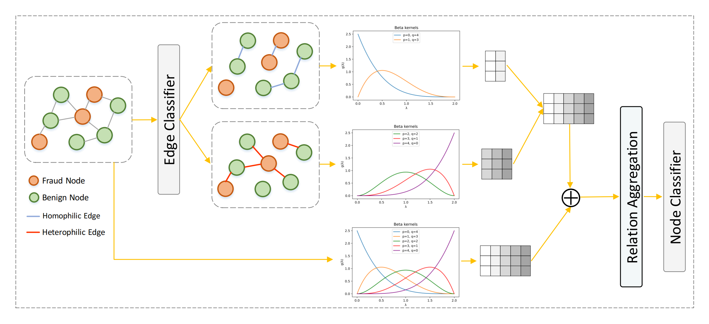

# SplitGNN

This is the PyTorch implementation of SplitGNN: Spectral Graph Neural Network for Fraud Detection against Heterophily.



# Dependencies

- [PyTorch](https://pytorch.org/) >= 1.11.0
- [DGL](https://www.dgl.ai/) >= 0.9.1

# Usage

- ```src/```: includes all code scripts.
- ```data/```: includes original datasets:
  - ```YelpChi.zip```: The original dataset of YelpChi, which contains hotel and restaurant reviews filtered (spam) and recommended (legitimate) by Yelp.
  - ```Amazon.zip```: The original dataset of Amazon, which contains product reviews under the Musical Instruments category.
  - ```FDCompCN.zip```: The processed dataset of FDCompCN, which contains financial statement fraud of companies in China from CSMAR database.
- ```config```: includes the setting of parameters for two datasets.
  - ```yelp.yaml```: The general parameters of YelpChi.
  - ```amazon.yaml```: The general parameters of Amazon.
  - ```comp.yaml```: The general parameters of FDCompCN.
- ```result```: includes the results of models.

# Model Training

We take YelpChi as an example to illustrate the usage of repository.

```
# Unzip the dataset
upzip ./data/YelpChi.zip ./data/

# Move to src/
cd src/

# Convert the original dataset to dgl graph
# The generated dgl graph contains the features, graph structure and edge labels.
python data_preprocess.py --dataset yelp

# Train and test the dataset
# If you want to change the parameters in training process, you can modify the corresponding yaml file in config.
python train.py --dataset yelp 
```

# Data Description of FDCompCN

| Dataset  | \#Nodes | #Fraud(%)   | \#Features | Relation                              | \#Edges                              |
| -------- | ------- | ----------- | ---------- | ------------------------------------- | ------------------------------------ |
| FDCompCN | 5,317   | 559 (10.5%) | 57         | C-I-C<br />C-S-C<br />C-P-C<br />Homo | 5,686<br />760<br />1,043<br />7,407 |

A new fraud detection dataset **FDCompCN** for detecting financial statement fraud of companies in China. We construct a multi-relation graph based on the supplier, customer, shareholder, and financial information disclosed in the financial statements of Chinese companies. These data are obtained from the China Stock Market and Accounting Research (CSMAR) database. We select samples between 2020 and 2023, including 5,317 publicly listed Chinese companies traded on the Shanghai, Shenzhen, and Beijing Stock Exchanges.

**FDCompCN **has three relations:

1) C-I-C that connects companies that have investment relationships.
2) C-P-C that connects companies and their disclosed customers. 
3) C-S-C that connects companies and their disclosed suppliers. 

Each company contains basic and financial statement information. The basic information includes registered capital, currency, operating status, company type, industry, city, personnel size, and the number of insured individuals. The financial statement information includes such as long-term accounts receivable, long-term liabilities, and total assets. The original financial statement information contains 149 indicators. We retain 49 financial indicators. Finally, we process the basic information and financial statement information into 57-dimensional features. Financial statement fraud includes seven types of violations disclosed by Chinese regulators, including inflated profits, inflated assets, false statements, delay in disclosure, omission of significant information, fraudulent disclosures, and general accounting irregularities. Companies with more than three violations are labeled as fraudulent samples, while other companies are labeled as benign. 559 fraud samples and 4758 benign samples are ultimately obtained, with fraud samples accounting for 10.51%.